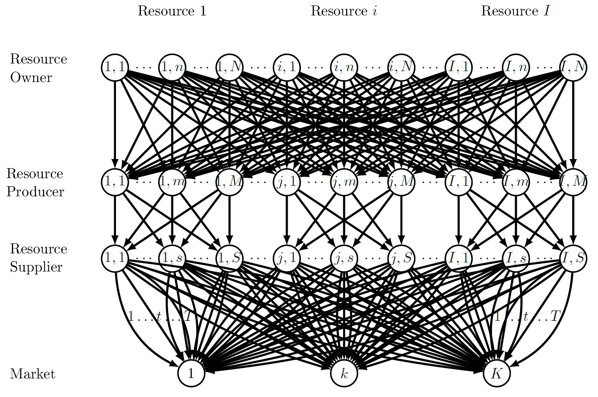

# Relief and Stimulus in A Cross-sector Multi-product Scarce Resource Supply Chain Network 
This repository is the data release from the article: 
Hu, X., Li, P., & Jang, J. (2021). Relief and Stimulus in A Cross-sector Multi-product Scarce Resource Supply Chain Network. arXiv preprint [arXiv:2101.09373](https://arxiv.org/abs/2101.09373).

 
## Abstract

In the era of a growing population, systemic change of the world, and rising risk of crises, humanity has been facing an unprecedented challenge of resource scarcity. Confronting and addressing the issues concerning the scarce resource's conservation, competition, and stimulation by grappling their characters and adopting viable policy instruments calls the decision-makers' attention to a paramount priority. In this paper, we develop the first general decentralized cross-sector supply chain network model that captures the unique features of the scarce resources under fiscal-monetary policies. We formulate the model as a network equilibrium problem with finite-dimensional variational inequality theories. We then characterize the network equilibrium with a set of classic theoretical properties, as well as some novel properties (with λmin) that are new to the literature of network games application. Lastly, we provide a series of illustrative examples, including a medical glove supply chain, to showcase how our model can be used to investigate the efficacy of the imposed policies in relieving the supply chain distress and stimulating welfare. Our managerial insights encompass the industry profit and social benefit vis-à-vis the resource availability and policy instrument designs. 

## Network Topology

 
